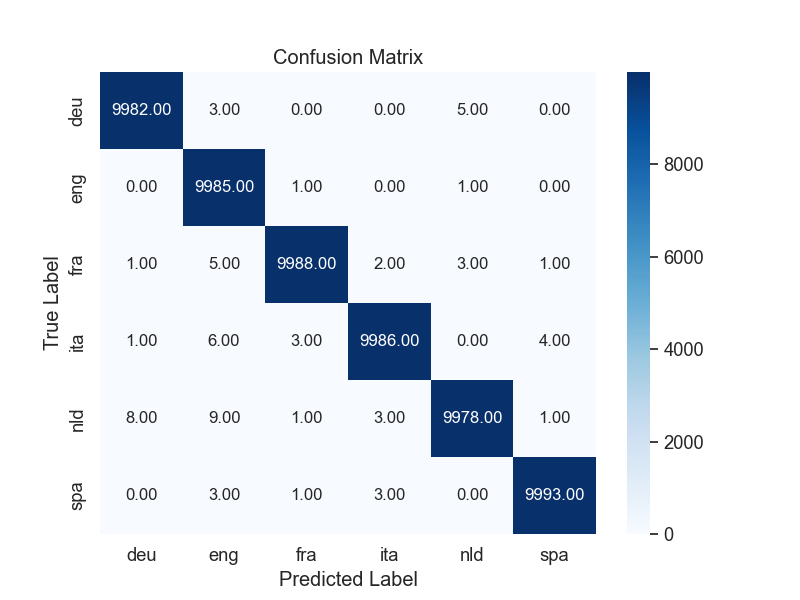

# Language Detection Using Character Trigrams and LID

## Project Overview
This innovative project harnesses the power of character trigrams and Lidstone's Law (LID) to accurately identify the language of given text phrases. Designed to distinguish among multiple languages with high precision, our model showcases the effectiveness of leveraging statistical methods and NLP techniques in computational linguistics.

## Key Features
- **Character Trigrams**: Utilizes sequences of three characters as a fundamental feature for language detection.
- **Lidstone's Law Application**: Employs LID for reliable probability estimation, enhancing the model's predictive accuracy.
- **Multilingual Support**: Capable of identifying English, Spanish, Italian, Dutch, German, and French, catering to a broad linguistic spectrum.
- **High Accuracy**: Achieves an exceptional F1-score of over 99.89%, demonstrating superior performance.

## Results
Our model has demonstrated unparalleled accuracy in language detection, achieving an F1-score exceeding 99.89%. This level of precision makes it a highly reliable tool for various applications in NLP and linguistics.

### Confusion Matrix

*The confusion matrix illustrates the model's accuracy across different languages, showcasing its ability to correctly identify languages with minimal errors.*

## Additional Model: Naive Bayes Classification
In addition to our primary approach using character trigrams and LID, we have implemented a version with a Naive Bayes classification model. This model delivers excellent results, providing instant predictions which greatly enhance scalability. The Naive Bayes classifier further solidifies our project's capabilities, offering an efficient alternative for language detection tasks in high-demand environments.

## Conclusion
The Language Detection project, with its advanced use of statistical NLP techniques and the inclusion of a Naive Bayes classification model, stands out as a highly accurate and scalable solution for identifying text language. Its success is marked by high-performance metrics and flexibility in application, making it an invaluable tool for the field of computational linguistics.
